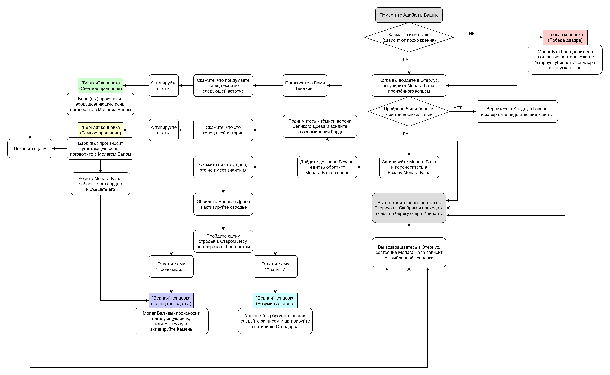

# Базовый гайд мода VIGILANT

<a href="https://translate.google.com/translate?sl=ru&tl=en&u=https://github.com/Meridiano/VST-Russian/blob/main/01-Vigilant/Базовый-гайд.md">English Google Translate</a>

<b>
Данный гайд не нацелен на раскрытие всех секретов VIGILANT,  
в нём описано лишь прохождение основных сюжетных веток.  
В настоящее время Aelarr работает над полной версией гайда,  
которая будет включать всё, что вы можете встретить в моде.
</b>

------

+ [О моде](#about-mod)
+ [Прохождение](#walkthrough)
    + [Эпизод I](#act-1)
    + [Эпизод II](#act-2)
    + [Эпизод III](#act-3)
    + [Эпизод IV](#act-4)
        + [Сторонние квесты IV эпизода](#act-4-side)
        + [Квесты-воспоминания IV эпизода](#act-4-memory)
    + [Дополнительные квесты](#radiant-side-quests)
        + [Радиант-квесты Дозорных](#rq-vigilant)
        + [Радиант-квесты Трубачей](#rq-piper)
        + [Личинка](#sq-maggot)
        + [Святой анатомант](#sq-holy-anatomancer)
        + [Наследие Белхарзы](#sq-belharza-legacy)
+ [Обзор локаций](#locations)
+ [Важные персонажи](#characters)
+ [Список торговцев](#merchants)
+ [Список спутников](#followers)
+ [Список улучшений](#collectables)
+ [Наковальня Зенитара](#zenithar-anvil)
+ [Отладочная комната](#debug-room)

------

##  О моде

VIGILANT даёт вам роль новичка-рекрута Дозорных Стендарра. Мод состоит из 4 частей или эпизодов, каждый из которых содержит свой главный квест. И хотя I эпизод отправляет вас на простые задания Дозора, далее история быстро становится довольно мрачной из-за даэдрического принца, который проявляет к вам нездоровый интерес. Устоите ли вы до конца... или подчинитесь?

VIGILANT создан под влиянием Dark Souls, однако он также сочетается с существующим лором The Elder Scrolls. Если вы хорошо знаете его, то обязательно оцените мод как уникальную отсылку к Алессианской истории, Башням, Шезарру, предыдущим играм TES, TESO и многому другому. Но учтите, довольно скоро мод перестанет "держать вас за ручку" при прохождении. Информация не будет дана вам на серебряном блюдке, а данный гайд не раскрывает аспекты истории, с которыми вы столкнётесь. Для этого будет создана полная версия гайда.

Каждый эпизод мода имеет собственный сюжет, состоящий из одного или нескольких квестов. И необязательно, что более короткие сюжеты несут меньше информации. В I и II эпизодах в игре будет достаточно квестовых маркеров, которые помогут вам в прохождении, но в III вам придётся искать подсказки самому, а в IV вы окажетесь предоставлены самому себе даже без записей в журнале квестов.

В моде присутствует особая геймплейная механика - карма. В процессе прохождения мода вы будете повышать или понижать свою карму в зависимости от принятых решений, завершённых квестов и убитых персонажей. В конце прохождения в зависимости от кармы вы получите либо плохую концовку, либо одну из "верных". Карма особенно важна в IV эпизоде, где вы можете очень сильно повысить или понизить её.

Технически, вы можете начать прохождение на любом уровне, но из-за сложности мода многие рекомендуют подождать хотя бы до 40-го. С обычными врагами вы сможете справиться на низких уровнях при помощи удачи, очень хорошего снаряжения или эксплойтов (а вот это нежелательно), но боссы, завершающие I и II эпизоды, а также сложность III и IV эпизодов скорее всего не оставят вам шансов на победу. Если вы любите вживаться в роль, также рекомендуется завершить всё, что связано с Молагом Балом в ванильной игре (квест "Дом ужасов" и DLC Dawnguard) и других модах. Почему? Потому что VIGILANT - это финальная часть конфликта между Молагом Балом и Довакином (если вы выбираете путь конфликта). Хотя мод не принуждает вас следовать какой-либо определённой роли.

По возможности возьмите с собой Сияние Рассвета. Многие враги в VIGILANT являются нежитью, так что меч может очень пригодиться, особенно если вы используете моды на его усиление. Если вы используете моды на потребности (еду, питьё, сон), вам также рекомендуется или запастись провизией, или временно отключить их, т.к. III и IV эпизоды содержат крайне мало еды. Там вы не сможете купить её и не сможете выбраться, пока не пройдёте сюжет.

Также есть предостережения касательно спутников: VIGILANT разработан для одиночного прохождения. И хотя вы можете взять с собой спутника или целую армию, это может оказаться проблемой. В моде довольно много мест, куда они не смогут последовать за вами, особенно в эпизодах III и IV. Но это ваша игра, так что поступайте, как считаете нужным.

VIGILANT это мрачная история. Она проведёт вашего персонажа (возможно, и вас тоже) через глубины самого ада, но это того стоит. Я надеюсь, этот мод понравится вам так же сильно, как и мне.

##  Эпизод I - Колдунья

> Примечание: любые моды, которые автоматически удаляют трупы существ, могут быть критически несовместимы - вы не сможете завершить квест "Так сказал каджит", т.к. труп каджита исчезнет из игры.

### Дозорный Стендарра

+ Когда вы войдёте в таверну "Пик ветров" в Данстаре, с вами заговорит Альтано и пригласит в Дозор.
+ Примите его предложение и следуйте за ним в храм Стендарра недалеко от Данстара.
+ Поговорите с Хранителем Торондиром.
+ Поговорите с Альтано.
+ По желанию осмотрите храм. Гвинет в библиотеке продаёт связанные с Дозором вещи, а справа от центральной части есть приспособления для крафта.

### Кровосос

+ Поговорите с Альтано и следуйте за ним или отправляйтесь сразу в Зал мёртвых в Вайтране, после чего поговорите с ним.
+ Задание: найти и уничтожить вампира, это Люсин. С 6 утра до 9 вечера она в таверне "Гарцующая кобыла", в другое время - у входа в Облачный район со стороны "Пьяного охотника".
+ Убейте её в любое время в любом месте, учтите - ночью она трансформируется в более сильного монстра.
+ Вернитесь к Альтано в Зал мёртвых, доложите о выполнении задания.

### Тот, До Кого Нельзя Дотронуться

+ Поговорите с Альтано в "Гарцующей кобыле".
+ Задание: разобраться с призванным даэдра - Вернаккусом. Он за стенами Вайтрана у заброшенного дома, где до нападения жил старый вор Винч Ловкач.
+ Альтано будет сопровождать вас до самого дома.
+ Когда Вернаккус появится, выслушайте его надменные речи и победите его, после чего поговорите с Альтано.

### Тихий час

+ Поговорите с Альтано в "Гарцующей кобыле".
+ Задание: разобраться с призванным даэдра - Катутетом. Он в таверне "Очаг и свеча" в Виндхельме.
+ Следуйте за Альтано или встретьтесь с ним на месте.
+ Выслушайте жалобу хозяйки таверны и победите вдрызг пьяного Катутета.
+ Доложите Альтано о выполнении задания. Даже он скажет, что не видел более несуразного даэдра.

### Глаз безумия

+ Поговорите с Альтано в "Очаге и свече".
+ Сходите в Рощу Кин и поговорите с Балором.
+ (Опционально) Вернитесь к Альтано, поговорите с ним и вернитесь в Рощу Кин.
    + Убейте Балора сразу.
    
        [ИЛИ](#ИЛИ)
    
    + Поговорите с Антоном Блистательным в таверне "Деревянное кружево". Примите его предложение помочь, возьмите любой из двух посохов и испытайте его на Балоре.
+ Вернитесь к Альтано в "Очаг и свечу", доложите о выполнении задания.

### Поел и сбежал

+ Поговорите с Альтано в "Очаге и свече", узнайте о новостях из сигнальной башни Стендарра.
+ Следуйте за Альтано или встретьтесь с ним у башни недалеко от Рифтена.
+ Ментор Анкано - Джейкоб - расскажет о появлении даэдра в таверне "Пчела и жало" в Рифтене, с которым нужно разобраться.
+ Следуйте за Альтано или встретьтесь с ним в таверне.
+ Даэдра Амкаос требует больше еды и угрожает мирному населению, победите его.
+ Оказывается, до вашего прихода он проглотил еды на 1000 септимов, поэтому Кирава будет требовать их с вас, раз даэдра больше нет.
    + Выплатите ей всю сумму полностью из своего кармана.
    
        [ИЛИ](#ИЛИ)
    
    + Займите у Альтано 800 септимов и отдайте ей 1000.
+ Вернитесь к Джейкобу к сигнальной башне Стендарра, доложите о выполнении задания.

### Так сказал каджит

+ Джейкоб скажет, что есть кое-какие признаки призыва даэдра в Крысиной Норе под Рифтеном.
+ Поговорите с Альтано и встретьтесь с ним в "Буйной фляге" в Рифтене.
+ Задание: найти каджита (Джо'ванни), который призвал даэдра (Эмпуса). Здесь вас ждёт небольшая развилка.
    + Поговорите с Антоном Блистательным в "Буйной фляге", возьмите у него посох умеренного света.
    + Найдите каджита и убейте его полученным от Антона посохом, когда он нападёт.
    + При желании можете найти в Крысиной Норе каджита Мар'со и выслушать несколько его реплик.
    
        [ИЛИ](#ИЛИ)
    
    + Идите в хранилище Крысиной Норы и поговорите с Джо'ванни.
    + Когда он на вас нападёт, убейте его и спустя пару секунд потеряйте сознание.
    + Очнитесь в разуме Джо'ванни на его месте, поговорите с его женой - Кампане'рой.
    + Сядьте за стол и снова поговорите с ней.
    + Когда она исчезнет, в доме появится каджит Мар'со, поговорите с ним.
    + Когда он исчезнет, в доме появится даэдра Эмпуса - убейте его и спустя пару секунд потеряйте сознание.
    + Очнитесь у тела Джо'ванни в хранилище Крысиной Норы, после чего найдите каджита Мар'со и поговорите с ним.
    + Когда он на вас нападёт, убейте его и заберите с его тела шкуру Кампане'ры.
    + Вернитесь в хранилище Крысиной Норы под Рифтеном и "отдайте" Джо'ванни шкуру Кампане'ры.
+ Вернитесь к Альтано в "Буйную флягу", доложите о выполнении задания.

### Старые грехи

+ Вернитесь к сигнальной башне Стендарра, встретьте наёмника колдуньи.
+ Проигнорируйте его совет уйти по-хорошему и убейте его, получив ключ от подвала башни.
+ Откройте люк башни и спуститесь в подвал.
+ Встретьте раненого Джейкоба и выслушайте его.
+ Альтано пойдёт вперёд в подземелье, следуйте за ним, но не оставляйте Джейкоба одного (он пойдёт за вами, по пути останавливаясь и разговаривая с призраками).
+ Когда Альтано и Джейкоб пройдут по мосту, они войдут в пещеру с алтарём Молага Бала. Следуйте за ними.
+ После короткой сцены убейте колдунью (Бал/Рахель) и заберите с её тела булаву Молага Бала.
+ Отдайте булаву Альтано и поговорите с ним.

### Без пощады

+ Альтано, которым явно овладела жажда крови, пошлёт вас убить ведьм возле Айварстеда (ведьму и её ребёнка).
+ Ступайте к хижине алхимика, что южнее Айварстеда, найдите вход в зону "Ведьмин пруд", доберитесь до убежища ведьмы.
+ Встретьте Карен и Лилиан в хижине, начните диалог с Карен.
    + **(Понижение кармы)** Начните разговор с "Я из Дозорных Стендарра". Карен и Лилиан начнут спасаться бегством, и вам придётся убить их.
    
        [ИЛИ](#ИЛИ)
    
    + **(Нейтральная карма)** Начните разговор с "Что ты здесь делаешь?", после чего предупредите Карен об опасности.
        + Вернитесь к Альтано (он всё ещё у алтаря Молага Бала).
        + В разговоре с ним твёрдо откажитесь убивать невинных, иначе вам придётся вернуться к ним и убить их **(Понижение кармы)**.
        + Здесь находится ещё одна развилка.
            + Позвольте Альтано ударить вас несколько раз и потеряйте сознание.
            + Очнитесь в хижине рядом с телами Карен и Лилиан (вы всё-таки убили их под воздействием Альтано).
            + Получите проклятие Стендарра и выйдите из хижины. По желанию поговорите с ведьмой Рейдой, чтобы получить некоторые объяснения.
            + В этом случае история продолжается в квестах "[Бесконечное падение](#бесконечное-падение)" и "[Приземление](#приземление)".
            
                [ИЛИ](#ИЛИ)
            
            + Победите Альтано, а затем и Уродливого - монстра, внешне похожего на Молага Бала.
            + В этом случае история продолжается в квесте "[Акт милосердия](#акт-милосердия)".

### Бесконечное падение

+ Доберитесь до храма Стендарра и встретьте там Альтано.
+ Поговорите с Альтано и разберитесь с призванным им даэдра, пока сам Альтано исчезает.
+ Спуститесь в библиотеку, найдите Гвинет и поговорите с ней.
+ Доберитесь до алтаря Молага Бала под сигнальной башней Стендарра, по пути разговаривая с призраками.
+ Когда призванный Альтано Молаг Бал в форме ящера убьёт его, начните диалог с даэдрическим принцем.
    + **(Понижение кармы)** Отдайте свою душу Молагу Балу и продолжите чтение гайда с [эпизода IV](#Act-4) (да, вы пропускаете II и III эпизоды).
    
        [ИЛИ](#ИЛИ)
    
    + **(Повышение кармы)** Дважды откажитесь от предложения Молага Бала и победите его в бою. Осторожно, у него иммунитет к огненной магии!

### Приземление

+ Поговорите с Альтано после победы над Молагом Балом.
+ Уничтожьте булаву Молага Бала при помощи оружия или заклинания.
+ Выслушайте Молага Бала и получите его метку - своеобразное "благословение".
+ Вернитесь в храм Стендарра, поговорите с Гвинет и станьте новым Хранителем.
+ Получите Рог Стендарра и избавьтесь от проклятия Стендарра, полученного при убийстве Карен и Лилиан.

### Акт милосердия

+ После победы над Альтано и Уродливым вам придётся поговорить с Карен.
+ Вне зависимости от того, что вы ей скажете, она нападёт на вас. Убить её вы не сможете, только остановить.
+ Когда Карен без сил будет лежать на полу, поговорите с ней.
    + Скажите ей то, что считаете нужным, и покиньте зал.
    + Доложите Торондиру о выполнении задания, выслушайте планы Хранителя.
    + Примите Рог Стендарра и останьтесь, чтобы приглядывать за храмом.
    
        [ИЛИ](#ИЛИ)
    
    + Убейте Карен. Когда вы это сделаете, то почти сразу получите дротик с ядом от Лилиан, которая пряталась в засаде.
    + Умерев, вы попадёте в туннель между жизнью и смертью. У вас лишь один путь - вперёд.
    + Добро пожаловать в Хладную Гавань, продолжите чтение гайда с [эпизода IV](#Act-4) (да, вы пропускаете II и III эпизоды).

### Ведьма Айварстеда

+ Если вы убили Карен в ходе квестов I эпизода, вы можете вернуться к Рейде на ведьмин пруд и сразиться с ней.
+ Если хотите - выслушайте её самодовольные речи, после чего скажите "Я убью тебя, ведьма".
+ Она начнёт телепортироваться вокруг и призывать из пруда баливогов и граммитов, заодно разговаривая с вами.
+ Убивайте всех этих существ и наносите ей урон при любой возможности.
+ После боя начните диалог с ней.
    + **(Понижение кармы)** Пощадите её и идите к выходу. Встретьте Рейду там и выслушайте её насмешки и обещания уничтожить Айварстед. Это не шутки, она отправит туда граммитов, и они убьют всех не-бессмертных персонажей. А чего вы ожидали от злой ведьмы?
    
        [ИЛИ](#ИЛИ)
    
    + **(Повышение кармы)** Скажите Рейде, что её участь решена. Когда она снова начнёт бой, убейте её.

##  Эпизод II - Кровавая Матрона

> Примечание: квест "Пустые клетки" - единый квест, который продолжается во время выполнения квестов "Чистка" и "Кровавая Матрона". Последний квест доступен только после верного решения в определённый момент.

### Пустые клетки

+ Поговорить со стражником Виндхельма во дворе храма Стендарра.
+ Отправляйтесь в Виндхельм и поговорите с управителем, который поручает вам расследование происшествия: из подземелья Виндхельма пропадают заключённые и стражники.
+ Получите у него ключ от подземелья и спуститесь в него (пройдя через казармы стражи).
+ Зайдите в самую большую клетку и осмотрите статую - Каменную Деву.
+ Вернитесь к управителю и поговорите с ним. Узнайте, что такое уже происходило около 20 лет назад, и что записи об этом есть в храме Стендарра.
+ Вернитесь в храм Стендарра, спуститесь в библиотеку и найдите в одном из книжных шкафов рапорт из Виндхельма (подсказку может дать Гвинет).
+ Прочтите рапорт и получите ключ от Каменной Девы.
+ Вернитесь к управителю Виндхельма и поговорите с ним, после чего спуститесь в подземелье и откройте Каменную Деву.
+ Спуститесь в нижнюю точку катакомб, убивая злокрысов и диких вампиров на своём пути.
+ В комнате-цистерне встретьте орка-вампира Гваджи гро-Агнама.

### Чистка

+ Когда Гваджи нападёт на вас, убейте его и получите ключ от тайного прохода.
+ Откройте этим ключом люк, ведущий в кровавый колодец.
+ Встретьте внизу вампира Пауло, который испугается и бросится бежать. Убейте его и получите ключ от трущоб старого Виндхельма.
+ Откройте этим ключом дверь на противоположной стороне кровавого колодца и войдите в трущобы.
+ Трущобы старого Виндхельма - довольно большое, но линейное подземелье, в нём много закрытых дверей (в основном это пути возвращения) и диких вампиров.
+ В конце подземелья встретьте огромного вампира-зверя и убейте его **(Повышение кармы)**, после чего откройте полученным ключом от старого Виндхельма дверь в следующее подземелье.
+ Точно так же идите вперёд, убивая вампиров, пока не встретите нового огромного монстра - Кошмар Илиналты.
+ Убейте его **(Повышение кармы)** и получите старый ключ стражи Виндхельма.
+ Откройте этим ключом ворота, которые охранял монстр, и войдите в Прибежище.
+ Убивая вампиров, доберитесь до комнаты на втором этаже со светильником на столе.
+ Поговорите с вампиром по имени Тингол, после чего убейте появившегося вампира Джерико и его слуг.
+ Получите за это ключ тюремщика, откройте клетку Тингола и поговорите с ним.
    + Согласитесь прервать его страдания и убейте его.
    
        [ИЛИ](#ИЛИ)
    
    + Откажитесь убивать его. Можете поговорить с ним о чём-нибудь ещё, но для продолжения истории вы должны убить его. Другого выхода нет.
+ Идите в северную часть Прибежища и поднимитесь ко Дворцу Искусительницы, откройте вход ключом тюремщика.
+ Доберитесь до большого обеденного зала и пройдите вперёд по коридору.
+ Встретьте там вампира по имени Аредель, который после короткой речи нападёт на вас.
+ Убейте его и получите ключ Аределя. Квест "Чистка" на этом заканчивается, но эпизод продолжается.

------

+ Откройте дверь справа ключом Аределя и войдите в Покои Матроны.
+ Подойдите к открытому гробу Лами Бал и потеряйте контроль над персонажем. Вас пронзят острые копья и вы потеряете сознание.
+ Очнитесь во сне Лами, поговорите с ней и пройдите через долину по направлению к замку, который окутан туманом.
+ Встретьте у ворот замка самого Молага Бала, который предложит вам провести вечность вместе с Лами.
+ Начните диалог с Лами Бал (уже с внешностью вампира и кинжалом в груди).
    + **(Понижение кармы)** Ответьте ей "Хорошо, пойдем" и войдите в замок. Обратного пути нет, вам придётся коснуться алтаря и получить эффект "Кровь Лами". Продолжите чтение гайда с [эпизода IV](#Act-4) (да, вы пропускаете III эпизод).
    
        [ИЛИ](#ИЛИ)
    
    + **(Нейтральная карма)** Ответьте Лами Бал, что захотите, и вступите с ней в бой. Она пользуется невидимостью и призывает слабых вампиров, наносите ей урон при любой возможности.

### Кровавая Матрона

+ Победите Лами Бал (в её сне), потеряйте сознание и очнитесь в Покоях Матроны.
+ Заберите с тела Лами Бал (уже с внешностью древнего трупа) кинжал барда (поверьте, он пригодится буквально через минуту).
+ Идите к выходу и попадите в ловушку Молага Бала. Призрак проклятия Молага Бала появится на троне, воскресит Лами Бал и направит её против вас.
+ Убивать Лами Бал бесполезно, т.к. Молаг Бал (его проклятие) постоянно воскрешает её. Поэтому как можно скорее атакуйте проклятие Молага Бала кинжалом барда (любое другое оружие бесполезно).
+ Развейте проклятие Молага Бала **(Повышение кармы)** и вернитесь к управителю.
+ По желанию вы теперь сможете в любой момент вернуться в Покои Матроны и встретить там Фациса - торговца, который предупредит вас о пристальном внимании Молага Бала к вашей персоне.

##  Эпизод III - Дитя Обливиона

> Примечание #1: если у Гвинет нет новых строк диалогов после вашего возвращения из Виндхельма, выйдите из храма и войдите снова.  
> Примечание #2: вы не сможете выйти из поместья, пока не завершите эпизод, так что потребности в еде-питье-сне могут стать проблемой.  
> Примечание #3: данный эпизод содержит элементы хоррора. По большей части это атмосфера, но в некоторых ситуациях возможны и скримеры. Имейте это в виду.  

### Дитя Обливиона

+ Поговорите с Гвинет в библиотеке храма Стендарра. Она расскажет вам, что несколько месяцев назад в особняк Брюантов, что в Королле, был направлен Дозорный Бартоло. Контакт с ним был потерян из-за гражданской войны, но сейчас от него пришло письмо с просьбой о подкреплении.
+ Отправляйтесь в поместье Брюантов, используя повозку во дворе храма Стендарра (можете поговорить и поторговать с каджитом-извозчиком перед этим).
+ Перед входом в особняк встретьте айлейда по имени Бал, который крайне доброжелательно пригласит вас внутрь. Даже если вы станете подозревать его... в чём-либо. Хорошее существо Балом не назовут.
+ У вас нет особого выбора, так что войдите в особняк (южное крыло) и убедитесь, что вам из него больше не выбраться.
+ Кроме того, попрощайтесь с записями в журнале, ваша единственная задача - исследовать особняк и развеять проклятие. Подсказки о случившемся будут содержаться в дневниках и записках, но читать их или нет - ваше дело.
+ Для этого вам необходимо найти 5 тотемов Молага Бала и развеять части проклятия внутри них (это достигается убийством финальных боссов и деактивацией сигильских камней).
+ Итак, дело не ждёт. Идите по главному залу вперёд в сторону призрака Юлия Брюанта, который исчезнет, когда вы приблизитесь.
+ Обратите внимание на тело Марка Брюанта, заберите с него ключ Марка, можете прочесть записку.
+ Пока единственный доступный путь - налево от лестницы. Вы можете следовать за призраком Юлия к двери, ведущей в сад, но пока что она закрыта, так что поднимитесь наверх в комнату Марка и войдите в неё.
+ На столе будут лежать дневник Марка (4Э 201) и дневник Бартоло, но ваша главная цель - тотем Молага Бала среди пятен крови, Кровавое проклятие Дрожи. "Войдите" в него.

------

**Кровавое проклятие Дрожи**

+ Как и все кровавые проклятья этого эпизода, оно похоже на Другой Мир из серии Silent Hill. Стены покрыты кровью/ржавчиной, и двери слабо выделяются в этой гнетущей гамме.
+ Монстров можно условно разделить на 2 группы: одни маленькие и могут быть убиты без особых трудностей, другие большие и очень опасные, от них лучше убегать или прятаться.
+ Опасайтесь кроватей на стенах и потолках (серьёзно, в них зачастую скрыты острые копья или монстры).
+ Если хотите, можете поискать некоторые записки и подсказки.
+ В конце концов, доберитесь до комнаты с боссом, убейте его и развейте проклятие на алтаре.
+ Когда вы сделаете это, то получите ключ от комнаты прислуги и вернётесь в комнату Марка.

------

+ Вернитесь в главный зал, где вы нашли тело Марка, и откройте дверь, ведущую к комнатам слуг.
+ Оставайтесь на первом этаже, загляните в длинный коридор слева и увидьте у окна призрак Юлия. Идите к нему.
+ Не доходя до самого окна, откройте вторую комнату слева по коридору (это комната Бала).
+ На столе будут лежать несколько записок, но ваша главная цель - тотем Молага Бала среди пятен крови, Кровавое проклятие Скверны. "Войдите" в него.

------

**Кровавое проклятие Скверны**

+ Большая комната со многими этажами и огромным костром в центре. Идите всё время наверх, иногда применяйте свои навыки паркура, по-прежнему опасайтесь кроватей.
+ Комната с боссом на самом верху, убейте его и развейте проклятие на алтаре.
+ Когда вы сделаете это, то получите ключ от комнаты Юлия и вернётесь в комнату Бала.

------

+ Поднимитесь на второй этаж, не покидая секцию особняка для слуг, и откройте дверь в комнату Юлия (первая справа).
+ На столе лежит дневник Марка (4Э 200) и ключ от подвала, возьмите его.
+ С этого момента по этой части особняка начнут бродить очень страшные существа, одно из которых может подкрасться к вам сзади и попроветствовать леденящим душу воплем сразу после получения ключа.
+ Убить этих существ непросто, они будут преследовать вас, даже открывая двери. При взгляде на них ваш взор расплывается, а запас сил начинает быстро падать. Их вопли ошеломляют, так что если вы слышите их или звуки их приближения - заканчивайте свои дела как можно скорее и бегите сломя голову, не оглядываясь.
+ После этого вы можете заметить, что многие проходы и двери заблокированы плотью, а единственный путь назад лежит через дверь, от которой вы пришли.
+ Как и наверху, в подвале блуждает такое же существо - огромного роста Саммил. Обходите его, как только можете.
+ В комнате подвала со столом на цепи висит ключ от сада - берите его и пройдите в решётчатую дверь за столом. Опасайтесь Саммила.
+ После попадания в главный зал идите к двери, ведущей в сад, и откройте её полученным ключом.
+ Посреди сада есть небольшой пруд с перекинутым над ним мостиком. Нырните в воду и "войдите" в Кровавое проклятие Смуты.

------

**Кровавое проклятие Смуты**

+ Представляет собой лабиринт из клеток с монстрами и несколькими телами, на которых можно найти записки.
+ Постарайтесь избегать монстров и как можно скорее доберитесь до центра комнаты, где кружится смутный вихрь.
+ Уничтожьте этого босса и развейте проклятие на алтаре - это даст вам ключ от северного крыла особняка Брюантов и переместит обратно в сад.

------

+ Войдите в северное крыло особняка, используя полученный ключ.
+ На первом этаже нет ничего примечательного, поэтому поднимитесь на второй этаж и пройдите в сторону призрака Юлия, котоый будет стоять в конце коридора.
+ На комоде с окровавленным черепом будет лежать ключ от комнаты Бартоло, заберите его и войдите в комнату Бартоло рядом.
+ С этого момента те самые страшные и неуязвимые существа начнут бродить и по этой части особняка. Поскорее "войдите" в Кровавое проклятие Оков.

------

**Кровавое проклятие Оков**

+ Петляйте по простому лабиринту, прячась и убегая от гигантских монстров, доберитесь до большой комнаты с водой на полу.
+ Пересеките комнату, обойдя гигантов или убив их, и идите дальше.
+ В последней комнате победите Бартоло, который стал "рыцарем ржавой крови".
+ Развейте проклятие на алтаре, получите ключ от комнаты Джулии и вернитесь в комнату Бартоло.

------

+ Бегите в комнату Джулии: сначала спуститесь на первый этаж, затем найдите другую лестницу обратно на второй.
+ Войдите в комнату Джулии при помощи полученного ключа. На полу у кровати будет лежать дневник Джулии, а на столе - дневник Марка (4Э 199). Ваша цель - шкаф у дальней стены.
+ Откройте шкаф (он оказывается с фальшпанелью) и спуститесь вниз, следуя за призраком Юлия.
+ Откройте потайную комнату, после чего "войдите" в последний тотем (настоящий алтарь) Молага Бала - Кровавое проклятие Ревности.

------

**Кровавое проклятие Ревности**

+ Самое простое проклятие - просто идите вперёд к замку, по пути убивая монстров.
+ Алтарь охраняет Джулия Багровая, имеющая повадки дракона. Убейте её.
+ Развейте проклятие на алтаре и просто вернитесь в потайную комнату, не получив больше ничего.

------

+ В потайной комнате вас будет ждать дворецкий Бал. Когда он нападёт, убейте его и получите ключ от потайной комнаты.
+ Обойдите тотем Молага Бала сзади и поднимитесь по лестнице обратно в главный зал южного крыла.
+ Тела Марка там уже не будет, вместо него вы обнаружите тело Юлия, окружённое цветами, и проклятый кинжал.
+ Вы можете осмотреть тело Юлия и прочесть его записку, но главное - уничтожить кинжал.
+ После этого тело Юлия начинает сгорать, а затем взрывается, поджигая весь зал особняка. Юлий восстаёт и атакует вас.
+ После победы над Юлием у вас по-прежнему нет возможности покинуть горящий особняк, однако у лестницы появляется Молаг Бал с намерением "спасти" вас.
+ Поговорите с ним о его мотивах и отношению к смертным, после чего примите решение **(Нейтральная карма)**.
    + Жизнь. Скажите ему "Помоги мне выбраться", после чего пройдите через Врата Обливиона в Хладную Гавань. Вы ведь не думали, что Молаг Бал по доброте душевной просто перенесёт вас в вашу любимую таверну? Продолжите чтение гайда с [эпизода IV](#Act-4).
    
        [ИЛИ](#ИЛИ)
    
    + Смерть. Ответьте Молагу Балу, что захотите, после чего активируйте "Смирение" в центре зала и согласитесь сгореть в проклятом пламени.

### Наследник

+ Теперь вы играете за нового персонажа - одного из Дозорных Стендарра, который молится в храме.
+ Поговорите с Гвинет и отправьтесь на знакомой повозке в поместье Брюантов, чтобы выяснить судьбу Хранителя (вашего предыдущего персонажа).
+ По желанию вы можете поговорить с каджитом-извозчиком, после чего войдите в особняк.
+ Вокруг лежат осквернённые тела легионеров Империи, а посреди зала находятся останки Хранителя Стендарра. Заберите с них все вещи, утраченные в прошлом квесте.
+ Возьмите Рог Стендарра, лежащий перед обгоревшим телом, что приведёт к заметной смене обстановки.
+ По желанию вы можете поговорить с Чёрной Рукой и отбросами Ситиса (среди которых есть и Юлий Брюант), но выход у вас лишь один - войдите в чрево статуи Молага Бала.

##  Эпизод IV - Хладная Гавань

> Примечание #1: В вашем журнале квестов будет лишь несколько записей касательно этого эпизода, а также квестовых маркеров. Разговаривайте с нейтральными NPC - например, с инквизитором Пепе, который может просвятить вас насчёт ключевых моментов истории. Скажем так, ваша главная цель - добраться до башни в центре города, выбить дух из Молага Бала и вернуться в Скайрим.  
> Примечание #2: Вы останетесь в Хладной Гавани до тех пор, пока не завершите весь эпизод, а это может занять время. Еды в этом плане Обливиона крайне мало, так что или временно отключите свои моды на потребности, или приготовьтесь голодать.  
> Примечание #3: Карма теперь особенно важна. Вы повышаете её, помогая дружественным NPC, побеждая боссов и завершая квесты-воспоминания хорошими коцовками. Вы понижаете её, убивая невинных, получая плохие концовки в воспоминаниях и торгуя с Чёрной Рукой. Вы можете узнать ваш текущий уровень кармы, используя глаз Марука.  
> Примечание #4: Когда глаз Марука реагирует на что-то - это означает, что поблизости доступен квест-воспоминание. С его помощью вы также можете узнать, сколько видений вы уже "прошли".  
> Примечание #5: Предупреждение для арахнофобов: в локациях "Тайная пещера последователей Мары" и "Храм Мары" довольно много пауков, так что, возможно, вам не стоит ходить туда. Эти места не относятся к основному сюжету, так что вы можете пропустить их без особых проблем.

### Хладная Гавань

+ Неважно, как вы сюда попали, с этого момента прохождение одинаково для каждого.
+ Очнитесь в приорате Матмалату, получите глаз Марука и поговорите с инквизитором Пепе.
+ Он будет разочарован вами в любом случае, так что просто расспросите его, о чём считаете нужным.
+ Пройдите немного вперёд и загляние в небольшую статуэтку Марука на постаменте, там лежит ещё один глаз Марука (на всякий случай).
+ Выйдите из приората Матмалату и активируйте глаз Марука - это даст вам несколько подсказок (квестовых маркеров).
+ Отныне вы предоставлены только себе. Здесь описан кратчайший путь пройти эпизод, так что читайте внимательно.
+ Если вы хотите выбраться из Хладной Гавани ещё быстрее, обратите внимание на квест "[Личинка](#SQ-Maggot)".

**Прибрежный район**

+ После выхода из приората Матмалату идите налево и окажитесь среди двух смотровых вышек. Поднимитесь в левую и заберите ключ от форта Верин у капитана скампов - Спании.
+ Отправляйтесь в форт Верин и доберитесь до его вершины, убейте Вернаккуса и заберите его ключ от ворот Прибрежного района.
+ Откройте ворота и идите на север, по пути убейте летающего даэдрота Мента-На и заберите с его тела липкий ключ.
+ Подойдите к воротам в окрестности города и поговорите с Пепе.
+ Откройте ворота и выйдите из Прибрежного района.

**Окрестности города**

+ Всё время следуйте вокруг городских стен по часовой стрелке до тех пор, пока не окажетесь у входа в трущобы (это довольно далеко на северо-востоке).

**Трущобы нищих**

+ Найдите лестницу с люком на второй этаж, убейте там старшего нищего (с огромным бревном в руках) и получите ключ нищего.
+ Вернитесь на первый этаж и откройте этим ключом дверь в "Нору нищих".
+ Доберитесь до переправы в тюремную башню и поговорите с Пепе, который будет вас там ждать.
+ Спуститесь к воде и активируйте лодку, она перенесёт вас ко входу в канализацию тюремной башни.
+ Путь туда преградит большая... штука из плоти с глазами - атакуйте её, пока она не "лопнет" (не бойтесь, она безвредна).

**Тюремная башня**

+ Спускаться в самый низ необязательно, найдите похожую штуку из плоти, уничтожьте её и двигайтесь вперёд.
+ Пройдите небольшой лабиринт и доберитесь до входа в саму тюремную башню.
+ Короткий путь к выходу пока закрыт, так что найдите пролом в стене и двигайтесь вперёд по запутанным коридорам.
+ Пройдя всю тюрьму, несколько раз спустившись и поднявшись, дойдите до моста в центре тюрьмы.
+ Пройдите мост и подойдите к выходу из тюремной башки, где на вас нападёт надзиратель Уигхул. Убейте его и заберите его ключ надзирателя, после чего выйдите в Тюремный район.

**Тюремный район и Имперский Город**

+ Подойдите к мосту, ведущему в город, откройте ворота рычагом и дойдите до входа на Площадь Восьми Святых.
+ Снова идите по часовой стрелке, открывая ворота соответствующими рычагами. Ваша цель - курия Моримат.
+ В курии Моримат убейте архимонаха Центия и получите его ключ от Святилища Золота (оно здесь же, в курии).
+ Доберитесь до конца святилища и заберите из огромного золотого яйца Джунала ключ от района Правосудия.
+ Выйдите из курии Моримат и вернитесь назад - к мосту в район Правосудия. Пройдите его и войдите в район Правосудия.

**Район Правосудия и Малада**

+ Поговорите с Пепе, который стоит недалеко от входа и узнайте от него, что ваша цель - монастырь Братства Марука, а затем - Малада.
+ Идите глубже в район Правосудия, откройте ворота, ведущие к Первому суду инквизиторов (рычаг слева от ворот, поднимитесь по лестнице).
+ Пройдя Первый суд инквизиторов, идите в сторону монастыря Братства Марука, сначала поднимитесь на него, затем спуститесь до входа в Подземный монастырь Марука.
+ Пройдя весь монастырь сверху вниз, доберитесь до портала в Маладу. Убейте аббата Космаса и зайдите в портал.
+ Пройдя весь храм Малада, доберитесь до комнаты с пророком-имгой Маруком и поговорите с Пепе. Он скажет, что Марука следует убить.
+ У вас нет другого выхода, отключите защиту, повернув вентиль сзади "генератора поля", и убейте имгу.
+ Поговорите с Пепе, он расскажет вам, что барьер вокруг Имперского Города теперь развеян и его долгая прогулка окончена.
+ Также он скажет, что вам необходимо попасть в башню Санкремор, чтобы выбраться из Хладной Гавани. Для того, чтобы попасть в башню, вам нужны 2 ключа: ключ от Центрального района и сердце Дро'зела (безумного каджита, слуги Молага Бала).
+ Далее появляется Лаза (воин армии Порядка), убивает Пепе и нападает на вас. Победите его и вернитесь в район Правосудия, а затем - в Имперский Город.

**Имперский Город и башня Санкремор**

+ После уничтожения барьера по всему городу будут возникать солдаты армии Порядка. Вы можете убивать их сколь угодно долго, но лучше просто обходите их.
+ Особняк Малатар, в котором живёт безумный Дро'зел, находится ровно на севере Имперского Города, так что идите снова по часовой стрелке.
+ По пути вам встретятся ворота, которые открываются не рычагами, а заклинаниями соответствующих школ. Попадите нужным заклинанием по эмблеме над воротами, и они откроются.
+ В особняке Малатар слушайте Дро'зела и убивайте костяных созданий, в конце убейте беспомощного Дро'зела и заберите у него ключи.
+ Доберитесь до центральной башни Санкремор, открыв одни из 4 ворот в Центральный район. Войдите в башню, "открыв" её сердцем Дро'зела.
+ Внутри башни вас будет ждать Пепе, по желанию можете поговорить с ним. Далее идите прямо наверх и войдите в Санкремор Сейсель.
+ Внутри вас встретят сражающиеся армии Молага Бала и Порядка. Можете игнорировать их, ваша задача - подниматься всё выше и выше, используя руны кровавого проклятия (своеобразные лифты).
+ В конце подъёма вас будет ждать огромный даэдра Дрегас Убийца Глупцов. Убейте его, получите его ключи и войдите в Санкремор Нагасель.
+ Убейте алессианцев, удерживающих барьер вокруг тела святой Алессии, после чего вступите в центр площадки.
+ Вас встретит Волар Несущий Смерть, убейте его и получите его ключ от Санкремор Ангасель.
+ Подойдите к Алессии, но будьте осторожны - как и в случае с Пепе с неба спустится Лаза и убьёт её, отрубив голову.
+ Сразитесь с ним, убив уже окончательно, после чего войдите в Санкремор Ангасель.
+ За троном Молага Бала будет лежать ослабленный сам даэдрический принц. Разумеется, вы не можете убить его, но попытаться стоит. Когда он обратится в пепел, заберите у него Адабал.

### Этериус

+ Результат ваших дальнейших действий зависит от кармы, пройденных квестов-воспоминаний и сказанных слов. Удобнее всего будет показать развитие событий при помощи блок-схемы. Серым цветом обозначены начало и конец, другими цветами - различные концовки. Кликните по изображению для просмотра в полном размере.

### Возвращение

+ Придя в сознание, вы можете поговорить с Джа'заном, но вас больше не ждёт никаких особых заданий.
+ Вы можете вернуться в храм Стендарра. Его состояние будет зависеть от того, покорились ли вы Молагу Балу в первом акте. Если храм цел, то:
    + Вы можете вернуться в Хладную Гавань (в приорат Матмалату), используя каменную табличку на столе в библиотеке храма Стендарра.
    + Вы можете вернуться в поместье Брюантов, где вам будет не рад довольно грубый офицер Като, который расследует гибель семейства и всех слуг.
    + Каджит-извозчик М'кай в любом случае будет рад вас видеть.
    + Вы можете спросить у Гвинет про слухи, это начнёт небольшой квест "[Святой анатомант](#SQ-HolyAnatomancer)".
+ В зависимости от выбранной вами "верной" концовки, у корней Великого Древа в Скайриме появятся могила Лами или тотем Молага Бала. Коснитесь их - и получите новое заклинание плаща.
+ Конец IV эпизода, конец сюжета VIGILANT.

##  Сторонние квесты IV эпизода

### Рыцарь Акатоша

+ Сэр Амиэль наслаждается ветром у пограничной башни Аниаммис.
+ Может стать вашим спутником, если ваша карма больше 0.

### Рыцарь Мары

+ Сэр Казимир - финальный босс в старом храме Восьми Божеств.
+ Для битвы с ним рекомендуется подтянуть сопротивление огню.

### Рыцарь Талоса

+ Сэр Берик находится в зале молитв старого храма Восьми Божеств.
+ Может стать вашим спутником, если ваша карма больше 20.

### Лучник Кин

+ Бурлор учится метать ножи в своём доме в Прибрежном районе.
+ Может стать вашим спутником, если вы победите Вернаккуса в форте Верин, заберёте у него лук Бурлора и вернёте ему.
+ Наверху лестницы, ведущей к порталу из Этериуса в Скайрим, вы можете взять книгу по его призыву.

### Святой труп

+ Хранитель могил ждёт вас в своём доме в Прибрежном районе.
+ Согласитесь помочь ему найти святой труп, части которого раскиданы по Хладной гавани.
+ Всего частей 7, каждая находится возле якоря Молага Бала, все подсвечены. Якори расположены у воды.
    + Правая нога - к югу от пограничной башни Аниаммис.
    + Левая нога - к западу от дороги перед вратами Варлы.
    + Правая рука - у западного входа в трущобы на севере.
    + Левая рука - к северо-западу от ворот, ведущих в склепа Сард.
    + Ладони - к юго-востоку от дороги перед пограничной башней Агеа.
    + Грудь - к западу от места встречи с Ралвасом, рыцарем Зенитара.
    + Голова - к востоку от входа в подземный приорат Марука.
+ Когда вы принесёте хранителю могил все части, проведите сожжение и получите награду.

### Похороны

+ Марта ходит около надгробий недалеко от двух смотровых вышек Прибрежного района.
+ Скажите ей, что постараетесь найти могилы членов её семьи (братьев).
+ Могилы находятся на севере острова - на кладбище церкви Аркея.
+ Активируйте могилу Йохана, выполните квест "[Йохан глупец](#йохан-глупец)" и вернитесь к Марте.
+ После разговора с ней она отправится к церкви Аркея, где вы сможете найти её спустя некоторое время.
+ Поговорите с ней возле могил, покиньте кладбище и вернитесь на него снова. Если в воспоминании Йохана вы отказались от булавы, Марту можно будет взять в спутники, иначе она будет мертва.
+ В любом случае вы можете сорвать несколько белых цветов с могил её братьев для квеста "[Дракон Кин](#дракон-кин)".

### Лысый Человек-Обезьяна

+ Имга Саклас из Талмора обитает в своём доме в Прибрежном районе, напротив лавки "Припасы разбойника".
+ Он попросит вас дойти до [библиотеки Джунала](#джунал-филин) в Имперском Городе и вернуться обратно.
    + Убейте его **(Понижение кармы)**.
    
        [ИЛИ](#ИЛИ)
    
    + Выполните его просьбу - побывайте внутри библиотеки и вернитесь к нему.
    + Когда он отправится туда сам, вы сможете найти его в библиотеке, но уже искажённым.
    + Поговорите с ним **(Нейтральная карма)**.

### Пёс работорговца

+ На кладбище церкви Аркея вы можете встретить пса по кличке Ал, который сидит рядом с телом работорговца.
+ Может стать вашим питомцем. Кроме того, вы можете изменить его внешний вид, приказав ему надеть шкуру белого волка (квест "[Рыцарь гончих](#рыцарь-гончих)").

### Последователи Мары

+ Если пойти на запад от статуи Варлы, вы найдёте тайную пещеру последователей Мары.
+ Зайдите в неё и пройдите до конца - вас будет ждать огромный Марам Живодёр. Убейте его **(Повышение кармы)** и заберите его ключ от храма Мары.
+ В храме Мары вас будут ждать враждебные последователи Мары, железные пауки и финальный босс - Ария Шепчущая. Просто убейте её **(Повышение кармы)**.

### Рыцарь Джулианоса

+ Вы будете постоянно встречать сэра Хенрика запертым в самых неожиданных местах.
+ Освободите его в доме работорговца в Прибрежном районе.
+ Освободите его на кухне форта Велкинд.
+ Освободите его в комнате пыток тюремной башни.
+ Освободите его в темнице суда Наарифина.
    + Согласитесь помочь ему: может стать вашим спутником, когда вы вернётесь с вестями о его друзьях (квест "[Рыцарь Кинарет](#рыцарь-кинарет)").
    
        [ИЛИ](#ИЛИ)
    
    + Откажитесь помогать ему: погибнет в конце квеста "[Рыцарь Кинарет](#рыцарь-кинарет)".

### Рыцарь Кинарет

+ Сэр Джункан будет встречаться вам в путешествии по Хладной Гавани.
+ У ворот Прибрежного района.
+ У статуи Варлы за воротами, которые охраняет Мента-На.
+ В боковой комнате Трассианской аптеки.
+ У тела сэра Грэгори возле высохшего колодца в Имперском Городе.
+ Является финальным боссом в Источниках Дибеллы (после прохождения суда Наарифина).

### Рыцарь Дибеллы

+ Сэр Грэгори оставляет свои записки в статуях Дибеллы, разбросанных по Хладной Гавани.
+ У статуи Варлы за воротами, которые охраняет Мента-На.
+ К востоку от форта Велкинд, у статуи Мэри.
+ Перед конюшней "Гнедые лошади".
+ В Трассианской аптеке.
+ На Площади Восьми Святых.
+ Перед воротами, ведущими к высохшему колодцу, которые открываются заклинанием.
+ Рядом с высохшим колодцем, перед статуей Алессии.

### Паладин Мелус

+ Мелус Петилиус просто хочет найти место потише, повсюду нося с собой тело своей жены Вены.
+ Вначале у кузницы "Ржавая" в Прибрежном районе.
+ Затем у конюшни "Гнедые лошади".
+ Наконец, он является финальным боссом склепа Сард (на северо-западе острова).

### Рыцарь Аркея

+ Сэр Торолф находится в церкци Аркея за кладбищем.
+ Он совершенно обезумел и предлагает вам пожертвовать своим телом, чтобы пойти по стопам Аркея.
+ Убейте его и заберите его двуручный меч Ануи-Эля.
+ Ударьте этим мечом по телу Аркея здесь же, в церкви.
+ Это откроет вам путь в зал костей, где будет находиться Чёрная Рука.

### Чёрная Рука

+ Находится в зале костей церкви Аркея (квест "[Рыцарь Аркея](#рыцарь-аркея)").
+ Вы можете поговорить с ней, только если на вас надето кольцо взора Ситиса.
    + Ступайте в подземный приорат Неньонд.
    + Доберитесь до Погребального храма.
    + Убейте чародея Мантхара - кольцо взора Ситиса будет у него.
+ Чёрная Рука может повысить ваши статы ценой кармы и рассказать пару интересных вещей.

### Атима

+ Атима это девочка-каджит, которая заразилась трассианской чумой и окончательно потеряла свой привычный облик.
+ Она греется у огня в самом низу канализации тюремной башни рядом с сэром Каем.
+ В Имперском Городе найдите склеп Ултар и убейте там графа Леада и графиню Тарлу, у которой будет шкура Атимы.
+ Верните Атиме её шкуру, и взамен она подарит вам свою любимую куклу.

### Рыцарь Стендарра

+ Сэр Кай следит за костром в самом низу канализации тюремной башни рядом с Атимой.
+ Убейте Атиму **(Понижение кармы)** и поговорите с рыцарем.
    + Скажите ему, что дети слабы и заслуживают смерти (он нападёт и вам придётся убить его).
    
        [ИЛИ](#ИЛИ)
    
    + Напомните ему о его рыцарском долге (он решит, что достаточно бездействовал, после чего может стать вашим спутником).

### Больше скумы

+ Джа'зан сидит в тюремной башне и ждёт своего конца.
+ Если вы откроете дверь слева от выхода в Тюремный район (ключ у надзирателя Уигхула), он выйдет на свободу и станет торговцем.

### Рыцарь Зенитара

+ Сэр Ралвас сидит на узком уступе на северо-западе Тюремного района. К сожалению, он в буквальном смысле потерял голову.
+ Вернитесь к Джа'зану (квест "[Больше скумы](#больше-скумы)") и поговорите с ним о чём-нибудь интересном.
    + **(Понижение кармы)** Убейте Джа'зана и заберите с его тела шлем рыцаря Зенитара.
    
        [ИЛИ](#ИЛИ)
    
    + **(Нейтральная карма)** Купите шлем всего за 100 септимов.
+ Вернитесь к сэру Ралвасу, отдайте ему его голову и помогите повернуть её в нужную сторону, после чего он может стать вашим спутником.

### Чёрный Червь

+ Доберитесь до приората Силорн на востоке через пещеру Свежий Источник.
+ Встретьте в тюрьме приората Чёрного Червя, примите решение.
    + **(Понижение кармы)** Выпустите его, после чего он отправится в приорат Матмалату и станет торговцем.
    
        [ИЛИ](#ИЛИ)
    
    + **(Повышение кармы)** Убейте его.

### Мститель

+ Вторая битва с Аределем (вампиром из II эпизода). Он является боссом склепа святой Дулсы в Имперском Городе.

### Рыцарь-великан Рито

+ Рито охраняет мост, ведущий к полю боя под Вейе.
+ Если к моменту вашего разговора вы убили Варлу в форте Велкинд (квест "[Рыцарь гончих](#рыцарь-гончих)"), он может дать вам копьё в знак благодарности.
+ Чтобы пройти через мост к Вейе, вам по-прежнему необходимо убить Рито.

### Папа Мегус

+ Находится в Святилище Золота курии Моримат. Будет атаковать вас, если вы не экипировали определённый предмет.
+ После убийства архимонаха Центия в курии Моримат возьмите у него посох Пелана - жреца Восьми Божеств.
+ С этим посохом в руках вы сможете поговорить с Папой Мегусом. Убейте его, когда сочтёте нужным **(Повышение кармы)**.

### Джунал Филин

+ Ключ от библиотеки Джунала находится в подземном монастыре Марука.
    + Главный ориентир - большая статуя Алессии.
    + Найдите справа от неё лестницу из плит, торчащих прямо из отвесной стены, спуститесь немного и перепрыгните на балкон слева.
    + Найдите магическую эмблему и примените к ней заклинание нужной школы, войдите в тайную комнату и осмотрите огромный скелет Джунала.
+ Вернитесь к библиотеке и откройте её, можете поговорить и поторговать с Джуналом в форме слизня, а потом убить его **(Повышение кармы)**.

### Дракон Кин

+ Дракон Кахкаанкрейн, поражённый кровавым проклятьем, заперт во Втором суде инквизиторов в районе Правосудия.
+ Ключ от его клетки находится у стража здесь же. Убейте стража, поговорите с драконом и откройте крышу темницы (рычаг у противоположной от входа стороны).
+ Спросите, чем ещё ему можно помочь, после чего дайте ему один из белых цветков (квест "[Похороны](#похороны)" или "[Сломанные рога](#сломанные-рога)").
+ Если вы заговорите с ним снова, имея в инвентаре перо Кин (квест "[Пелинал Кровавый](#пелинал-кровавый)" или "[Сломанные рога](#сломанные-рога)"), он попросит вас отдать его ему. У вас нет никаких причин оставлять перо у себя.

### Серый Марш

+ После убийства Марука в Маладе барьер, преграждавший путь к Вейе, будет разрушен.
+ Идите туда и войдите в Измерение Порядка.
+ Пройдите Первый коридор, Второй коридор, Большую пещеру и доберитесь до Трона Порядка.
+ Подойдите к недвижимому Джиггалагу и извлеките из его груди меч охотника на Камень.
+ Победите Джиггалага в бою и переместитесь при помощи колонны сразу на поле боя под Вейе.
+ С этого момента силы Порядка больше не будут появляться в Имперском Городе и его окрестностях (но не в башне Санкремор).

### Арена

+ Да, это именно арена, где вы сражаетесь с некоторыми боссами, которых уже одолели.
    + Серый Принц - босс, который находится на арене при первом вашем посещении.
    + Сэр Казимир - из квеста "[Рыцарь Мары](#рыцарь-мары)".
    + Сэр Джункан и Марам Живодёр - из квестов "[Рыцарь Кинарет](#рыцарь-кинарет)" и "[Последователи Мары](#последователи-мары)".
    + Пелинал Вайтстрейк - из квеста "[Пелинал Кровавый](#пелинал-кровавый)".
    + Морихаус - из квеста "[После бури](#после-бури)".
    + Джиггалаг - из квеста "[Серый Марш](#серый-марш)".
    + Мастер клинка - победите остальных противников.
+ После победы над всеми боссами (включая Мастера клинка), Гайден Шинджи появится у выхода с арены и сможет стать вашим спутником.

##  Квесты-воспоминания IV эпизода

### Рыцарь гончих  
(Сила кровных уз)

+ Форт Велкинд, поднимайтесь выше и выше, по пути можете убить пленника - [императора Белхарзу](#сломанные-рога) **(Повышение кармы)**.
+ В тронном зале Варлы сразитесь с охотником на людей Варлой, возьмите с его тела череп Энолы и шкуру белого волка (квест "[Пёс работорговца](#пёс-работорговца)").
+ Воспоминания Варлы: начните диалог с Белхарзой.
    + **(Понижение кармы)** Согласитесь с ним и убейте Энолу.
    
        [ИЛИ](#ИЛИ)
    
    + **(Повышение кармы)** Упорно откажитесь от требований Белхарзы. Когда сцена изменится, взойдите на корабль.

### Йохан глупец  
(Мёртвый сон под землёй)

+ Церковь Аркея - Кладбище - активируйте могилу Йохана.
+ Воспоминания Йохана: досмотрите сцену и поговорите с Балом.
    + **(Понижение кармы)** Примите булаву. Когда сцена изменится, убейте воскрешённую Марту-вампира. Досмотрите сцену.
    
        [ИЛИ](#ИЛИ)
    
    + **(Повышение кармы)** Откажитесь от булавы.

### Адабал  
(Танец на крови в свете луны)

+ Имперский Город - Склеп святой Дулсы - победите Аределя (квест "[Мститель](#мститель)") и активируйте скелет святой Дулсы.
+ Воспоминания Дулсы: дойдите до окровавленной скалы, по желанию можете начать диалог с Маруком.
    + **(Понижение кармы)** Позвольте Маруку ранить вас пару раз, упадите и выслушайте его слова.
    
        [ИЛИ](#ИЛИ)
    
    + **(Повышение кармы)** Убейте Марука, оставшись невредимой. Возьмите с его тела Камень и отдайте его пришедшему Пепе.

### Великий инквизитор  
(Бесплодные мечты тонут в тишине)

+ В самом низу канализации тюремной башни войдите в Ложе Скверны и убейте там Мэри Тёмную Деву.
+ Воспоминания Мэри: дождитесь диалога с инквизитором Пепе.
    + **(Понижение кармы)** Попытайтесь возразить ему.
    
        [ИЛИ](#ИЛИ)
    
    + **(Повышение кармы)** Храните молчание, дав инквизитору выговориться и в конце концов отпустить вас. Выйдите из тюрьмы по лестнице слева.

### Безумный король  
(Безумие приходит с лунами)

+ Особняк Малатар на севере Имперского Города - в самом конце активируйте скелет Хасаамы.
+ Воспоминания Хасаамы: поговорите с Дро'зелом дважды, во второй раз он спросит вас о барде.
    + **(Понижение кармы)** Ответьте, что он из Гильвердейла. Досмотрите сцену до конца (Дро'зел призывает Молага Бала у алтаря).
    
        [ИЛИ](#ИЛИ)
    
    + **(Повышение кармы)** Ответьте, что люди вроде него не имеют дома. Мирно закончите разговор.

### Сломанные рога  
(Сломанные рога, воплощение небес)

+ Для начала добудьте одну из двух реликвий на выбор.
    + Получите рога Белхарзы при убийстве Белхарзы в [форте Велкинд](#рыцарь-гончих).
    
        [ИЛИ](#ИЛИ)
    
    + Получите носовое кольцо Морихауса при убийстве Морихауса у [башни Бала](#после-бури).
+ В районе Инквизиторов найдите и победите Менелиона Крестителя **(Повышение кармы)**.
+ Войдите в столб красного света и согласитесь слить с ним свой разум.
+ В пещере активируйте осколок Белхарзы и получите Древний свиток Быка. Здесь же вы можете получить Белый Цветок для квеста "[Дракон Кин](#дракон-кин)".
+ Отправляйтесь в первый суд Инквизиторов и найдите там памятник Белхарзе.
+ Прочтите надпись и выберите правильный вариант (бык).
+ Когда в стене откроется проход, войдите в тайный склеп Белхарзы.
+ Пройдите подземелье, победите Амикуса Тарна и разместите Древний свиток Быка над пустым колодцем.
+ Войдите в темницу Белхарзы и отдайте ему реликвию **(Повышение кармы)**. Здесь же вы можете получить Перо Кин для квеста "[Дракон Кин](#дракон-кин)".

### Пелинал Кровавый  
(Когда сон перестаёт нуждаться в сновидце)

+ Первое воспоминание из цикла "Кровь Ада".
+ Идите на северо-восток острова к пограничной башне Агеа и победите там Пелинала.
+ Войдите в столб красного света и согласитесь слить с ним свой разум.
+ Воспоминания Пелинала: идите вперёд, убивая аврорианцев и элитных воинов Меридии. Доберитесь до трона Умарила Неоперённого, убейте двух рабынь и самого Умарила **(Нейтральная карма)**. Поговорите с Балом и следуйте за ним.
    + **(Понижение кармы)** Убейте Мэри, после чего выйдите из галереи Умарила, выслушайте Молага Бала и собственные мысли.
    
        [ИЛИ](#ИЛИ)
    
    + **(Повышение кармы)** Освободите Мэри, проводите её в главный зал и отпустите вместе с Корном. Поговорите с Балом, досмотрите сцену раскаяния Пелинала, получите перо Кин (квест "[Дракон Кин](#дракон-кин)").

### После бури  
(Напротив погибающего света)

+ Второе воспоминание из цикла "Кровь Ада".
+ Идите к пограничной башне Бала и [победите там Морихауса](#сломанные-рога).
+ Войдите в столб красного света и согласитесь слить с ним свой разум.
+ Воспоминания Морихауса: просто досмотрите сцену прощания Морихауса и Пелинала **(Нейтральная карма)**.

### Последняя ночь  
(Слепые глаза могут сиять как падающие метеоры)

+ Третье воспоминание из цикла "Кровь Ада", интерпретация восьмого тома "Песни о Пелинале".
+ Идите к пограничной башне Аниаммис в Прибрежном районе.
+ Войдите в столб красного света и согласитесь слить с ним свой разум.
+ В зависимости от выбора в квесте "[Пелинал Кровавый](#пелинал-кровавый)", просто досмотрите сцену прощания Пелинала и Алессии или поговорите с Акатошем **(Нейтральная карма)**.

### Останки чуда  
(Жрец смеётся в разбитой Башне)

+ Первая странная кучка песка в Бездне Молага Бала - активируйте её.
+ Воспоминания Пепе: просто поговорите с ним и выйдите из темницы крепости **(Нейтральная карма)**.

### Искушение Марука  
(Где спит человек-обезьяна?)

+ Вторая странная кучка песка в Бездне Молага Бала - активируйте её.
+ Воспоминания Марука: дойдите до мёртвого дерева, осмотрите скелет барда и возьмите Камень. Позади вас появится призрак святой Алессии.
    + **(Понижение кармы)** Согласитесь наполнить Камень душами и поместить его в Башню.
    
        [ИЛИ](#ИЛИ)
    
    + **(Нейтральная карма)** Убейте видение. Скелет барда заменится Молагом Балом, начните диалог с ним.
        + **(Понижение кармы)** Позвольте ему спасти вас от смерти.
        
            [ИЛИ](#ИЛИ)
        
        + **(Повышение кармы)** Откажитесь от его помощи, дождитесь окончания сцены после исчезновения Молага Бала.

### Безымянный бард  
(Камень горит в ожидании быть взятым)

+ Третья странная кучка песка в Бездне Молага Бала - активируйте её.
+ Воспоминания разных аспектов Молага Бала: одна из нескольких "верных" концовок квеста "[Этериус](#этериус)".

##  Дополнительные квесты

###  Радиант-квесты Дозорных

Эти "бесконечные" задания вы можете взять на доске объявлений перед главным входом в храм Стендарра, в ущелье Стуна. Они куда меньше остальных и не имеют развилок, поэтому находятся в категории "Разное". Награды за них выдаются случайно из специальных списков, содержащих золото, свитки, зелья и т.п. Также за выполнение этих заданий вы получаете очки Кармы и Праведности. Этот дополнительный ресурс можно потратить на увеличение здоровья, магии, запаса сил и дополнительные очки навыков. Для этого возле доски с заданиями есть специальный алтарь.

+ **Амбиции Меридии:** Необходимо отправиться в подземелье, пройти его и забрать цель ваших поисков - "Светоч: Восславление Меридии". Верните аналог Путеводной Звезды в храм и получите свою награду.
+ **Вампир:** Вам нужно вычислить вампира в одном из поселений Скайрима и убить его. Хорошим подспорьем в этом деле окажется заклинание обнаружения смерти - вы изучите его автоматически, если ещё не знаете. Награда зачисляется со смертью кровососа.
+ **Ведьма:** Ваша цель - добраться до логова ведьмы и убить её. Это будет человек, не ворожея, отличить цель можно по специфической одежде, это не обязательно глава всей шайки. Возвращаться за наградой в храм не требуется.
+ **Даэдрический призыватель:** Необходимо усмирить враждебных магов, которые призывают атронахов и дремора. Вознаграждение даётся сразу после убийства самого главного противника в логове.
+ **Потерянная реликвия:** Вам нужно забрать утраченный золотой рог Стендарра и вернуть его в храм. Каждый новый рог появляется в случайной пещере с дикими животными - например, троллем.
+ **Птенце-торговец:** Ваша цель - освободить сироту из лап птенце-торговца, рабовладельца из Эльсвейра. Вы можете заплатить каджиту 500 золотых или убить его, до или после разговора по душам. Отведите сироту из случайного поселении Скайрима в храм.
+ **Трубач:** Необходимо отправиться в лагерь разбойников и убить Трубача Стендарра - отступника, еретика, богохульника и т.д. Вы узнаете его по одежде Дозорных и характерному головному убору. Награда ваша, как только цель испустит дух.
+ **Эротическая книга:** Вам нужно забрать книгу у случайного мирного жителя Скайрима. Можно обойтись без крови - просто украсть её, после чего отнести в храм. При чтении книга поднимает навык владения одноручным оружием.

###  Радиант-квесты Трубачей

Недалеко от входа в храм Стендарра вы можете обнаружить дверь в подземелье, где можно взять задания, похожие на радиант-квесты Дозорных. За их выполнение вы также будете получать Карму и небольшие материальные награды, но вместо Праведности будет Сияние. Вы можете потратить этот ресурс в найденном подземелье при помощи Граалей Сияния - тел культистов. Все 5 заданий требуют просто убить цель, так что возвращаться за наградой в храм не требуется.

+ **Доппельгангер:** Ваша цель - найти и убить своего двойника. Вы не сможете увидеть его лицо из-за особого головного убора, но, по крайней мере, его имя будет совпадать с вашим.
+ **Кровосос:** Необходимо отправиться в подземелье с вампирами, чтобы убить там их главаря.
+ **Отродье:** Вам нужно добраться до логова дракона и убить там отродье Молага Бала. Это сильный противник, но и награда за него приличная - 1 ед. Кармы и 7 ед. Сияния.
+ **Охотник на ведьм:** Ваша цель - найти охотника на ведьм и убить его. Почти наверняка он будет сражаться с ведьмами или даже ворожеей в какой-нибудь башне, и это облегчает вашу задачу.
+ **Сновидец:** Необходимо спуститься в очередное подземелье и одолеть призрака.

###  Личинка

Этот квест - альтернативный способ выбраться из Хладной Гавани, воспользовавшись услугами святого анатоманта.
+ Найдите в Прибрежном районе Хладной Гавани дом "Старый колодец" и войдите в него.
+ Там вы найдёте святого анатоманта идентичного тому, что находится в подземелье у храма Стендарра.
+ Поговорите с ним и согласитесь отказаться от своего имени.
+ После этого вы окажетесь в том самом подземелье, откуда сможете выйти на волю. Конец?
+ Не совсем. Вы свободны ценой облика трёх случайных персонажей игры. Чтобы вы покинули Хладную Гавань, они превратились в отвратительных личинок.
+ Вы можете вернуть несчастным их изначальный вид, украв у четвёртой цели квеста своё имя. Но после этого вы снова попадёте в Хладную Гавань, в "Старый колодец".

###  Святой анатомант

Это задание становится доступным после завершения квеста "[Этериус](#этериус)". Итак, вы спросили Гвинет о слухах, и она поведала вам о загадочном предсказателе по имени "Бледные Стопы".
+ Отправляйтесь в Рифтен и найдите комнату анатоманта в Крысиной Норе.
+ Начните диалог через дверь и скажите, что испытания пройдены.
+ Анатомант задаст вам несколько вопросов о ваших приключениях, вам требуется ответить на них верно.
    + Камень был красным.
    + Безымянного нельзя воспевать.
    + Лаза.
+ Когда анатомант откроет дверь, поговорите с ним и решите, как поступить.
    + Убить анатоманта и сжечь его тело **(Повышение кармы)**.
    
        [ИЛИ](#ИЛИ)
    
    + Убить анатоманта и погадать по его внутренностям **(Нейтральная карма)**.
    
        [ИЛИ](#ИЛИ)
    
    + Помочь анатоманту найти "двуногую овцу" **(Понижение кармы)**.
    + Он даст вам посох паралича, который вы должны испытать на ребёнке в Рифтене.
    + Парализовав Урчина, заберите его с собой и доставьте анатоманту.
    + Положите ребёнка в станок, запустите механизм, поговорите с анатомантом и предскажите будущее.
    + В комнате с Трубачами активируйте Лаэлноа и получите плохую концовку.
    + Игра отказывается иметь с вами дело и переходит в главное меню.

###  Наследие Белхарзы

Это задание становится доступным после завершения квеста "[Сломанные рога](#сломанные-рога)" в Хладной Гавани. Найдите в ущелье Стуна минотавра Мордога и поговорите с ним.
+ Согласитесь отправиться с Мордогом в деревню минотавров.
+ Проследуйте за ним через деревню и поговорите с вождём Хорбаххой.
+ На выходе из деревни Мордог нагонит вас и попросится в спутники.
+ Вы можете взять его с собой или просто уйти из деревни.
+ Вы всегда можете вернуться к минотаврам через портал в ущелье Стуна.

##  Обзор локаций

> По сути это просто список локаций, изменённых или добавленных модом. Вы не найдёте здесь их описания.

+ Изменённые локации.
    + Данстар: таверна "Пик ветров".
    + Местность к востоку от Данстара: вход в ущелье Стуна.
    + Вайтран: зал мёртвых, таверна "Гарцующая кобыла".
    + Местность возле западной сторожевой башни: заброшенный дом.
    + Роща Кин: таверна "Деревянное кружево".
    + Рифтен: тайный вход в Гильдию, "Пчела и жало", "Буйная фляга", Крысиная нора.
    + Виндхельм: таверна "Очаг и свеча", королевский дворец, казармы стражи (вход в старый Виндхельм).
    + Местность возле хижины алхимика (к югу от Айварстеда): вход на ведьмин пруд.
    + Сигнальная башня Стендарра: вход в подвал.
+ Добавленные локации.
    + Ущелье Стуна с храмом Стендарра и подземельем.
    + Ведьмин пруд и хижина ведьмы.
    + Подвал сигнальной башни.
    + Старый Виндхельм.
    + Весь эпизод III - поместье Брюантов.
    + Весь эпизод IV - Хладная Гавань.
    + Комната анатоманта в "Крысиной норе".

##  Важные персонажи

> В моде VIGILANT вы можете встретить более сотни персонажей, большинство из которых почти не играют роли. Здесь перечислены лишь самые важные (а полный список будет доступен в полной версии гайда).

+ Альтано - ваш временный наставник из Дозора Стендарра. Будущий предатель, который примет сторону Молага Бала (не без последствий).
+ Джейкоб - наставник Альтано и ваш редкий квестодатель. В далёком прошлом спас потерявшего память Альтано от холодной смерти.
+ Гвинет - библиотекарь Дозорных. Участвует в сюжете не столь активно, очень беспокоится за ГГ.
+ Лами Беолфег (Лами Бал) - первая вампирша, с которой связан таинственный бард из далёкого прошлого.
+ Семья Брюантов - дворяне из Коррола, гибель которых вы расследуете в III эпизоде.
+ Бал (бард) - "всего лишь" слуга Молага Бала, встречается в воспоминаниях IV эпизода.
+ Пепе - много знающий ворчливый старик из IV эпизода, в прошлом - верховный инквизитор Алессианского Ордена.
+ Марук - имга-пророк, заложивший начало Алессианского Ордена. Последний "источник энергии" для барьера Молага Бала вокруг Хладной Гавани.
+ Алессия - Королева Рабов, начавшая восстание против айлейдов. Присутствует в воспоминании "[Последняя ночь](#последняя-ночь)".
+ Молаг Бал - даэдрический принц господства и порабощения, фактически - главный антагонист мода.
+ Шеогорат - даэдрический принц безумия, с интересом наблюдающий за происходящим (в основном - из воспоминаний IV эпизода).
+ Орланд Знающий - загадочный персонаж, который может отправить вас прямиком в Хладную Гавань. Может быть встречен в таверне Данстара и около особняка Брюантов.
+ Святой анатомант "Бледные Стопы" - опасный основатель группы Святых Трубачей, работающих против Дозорных в союзе с неизвестной силой (возможно, даэдра).

##  Список торговцев

+ Гвинет - библиотека храма Стендарра (ущелье Стуна).
+ Фацис - Покои Матроны (старый Виндхельм).
+ Епископ Арасил - арка моста, ведущего к полю боя под Вейе (Хладная Гавань).
+ Балор - Магазин "Счастье разбойника" в Прибрежном районе (Хладная Гавань).
+ Кадвелл - дом Кадвелла в Норе нищих (Хладная Гавань).
+ Ведьма Хильда - дом ведьмы в Прибрежном районе (Хладная Гавань).
+ Джа'зан старший - Тюремный район (Хладная Гавань).
+ Джа'зан младший - лагерь охотников у Камней-Хранителей (Скайрим).
+ Валькирия Глориэль - высохший колодец рядом со склепом Гориеуса (Имперский Город).
+ Огра Конюх - Конюшня "Гнедые лошади" (Хладная Гавань).
+ Джунал Филин - библиотека Джунала (Имперский Город).
+ Сабрина - Трассианская аптека (Хладная Гавань).
+ Тубал - кузница "Ржавая" в Прибрежном районе (Хладная Гавань).
+ Чёрный Червь - тюрьма приората Силорн, если не убит - приорат Матмалату (Хладная Гавань).
+ М'кай - каджит-извозчик в поместье Брюантов.
+ Чёрная Рука ("продаёт" статы за карму) - зал костей в церкви Аркея за кладбищем (Хладная Гавань).

##  Список спутников

> Хотя мод позволяет вам взять их с собой после определённых действий, это не рекомендуется по соображениям отыгрыша. VIGILANT предполагает одиночное прохождение, так что в некоторых моментах спутники будут... не к месту. Кроме того, их лучше не вызволять из Хладной Гавани (они уже давно мертвы, им не помочь).

+ Сэр Амиэль (квест "[Рыцарь Акатоша](#рыцарь-акатоша)").
+ Сэр Хенрик (квест "[Рыцарь Джулианоса](#рыцарь-джулианоса)").
+ Сэр Ралвас (квест "[Рыцарь Зенитара](#рыцарь-зенитара)").
+ Сэр Кай (квест "[Рыцарь Стендарра](#рыцарь-стендарра)").
+ Сэр Берик (квест "[Рыцарь Талоса](#рыцарь-талоса)").
+ Бурлор (квест "[Лучник Кин](#лучник-кин)").
+ Гайден Шинджи (квест "[Арена](#арена)").
+ Мордог Человек-Бык (квест "[Наследие Белхарзы](#sq-belharza-legacy)").

##  Список улучшений

> Эти вещицы (технически - зелья) могут быть найдены в совершенно разных местах по всей Хладной Гавани. Каждая из них по-своему повышает ваши характеристики.

+ Прах святой Сард. Навсегда увеличивает запас здоровья на 10 ед.
+ Кожа аббата Силорна. Навсегда увеличивает запас сил на 10 ед.
+ Кость Джунала. Навсегда увеличивает запас магии на 10 ед.
+ Окаменевшая душа дракона. Добавляет 1 душу дракона.
+ Старое перо Кин. Навсегда увеличивает максимальный переносимый вес на 20 ед.
+ Останки Бездушного. Повышает карму на 1 ед.
+ Гвоздь святой Дулсы. Добавляет 1 очко способностей.

##  Наковальня Зенитара

> Позволяет создавать (как в кузнице) оружие и броню из мода. Чем дальше вы пройдёте сюжет, тем больше рецептов будет доступно.

+ Храм Стендарра.
+ Отладочная комната (ущелье Стуна, Хранилище).
+ Подвал сигнальной башни.
+ Кузница "Ржавая" (Хладная Гавань, Прибрежный район).
+ Дом Кадвелла (Хладная Гавань, Нора нищих).
+ Арена (Хладная Гавань, Имперский Город).
+ Библиотека Джунала (Хладная Гавань, Имперский Город).

##  Отладочная комната

> Вы можете побывать здесь, если хотите купить вещи из мода, исправить неполадки, связанные с модом, или пропустить какой-либо эпизод. Иначе лучше даже не думать об этом месте.

+ Обратите внимание на статую мага с рогом Стендарра в ущелье Стуна.
+ Сзади неё будет небольшое нагромождение камней, поднимитесь по ним и найдите статуэтку филина на выступе стены.
+ В статуэтке будет лежать ключ от хранилища храма Стендарра.
+ Дверь находится в арке справа от статуи мага.
+ Доступные функции:
    + Белый филин продаёт броню и одежду.
    + Чёрный филин продаёт оружие, украшения и книги.
    + Картины позволяют пропустить/начать соответствующий эпизод (порядок справа налево).
    + Лютня остановит музыку, если та зависла.
    + После завершение IV эпизода вы можете взять ключ "Пьющий души" из скелета Стендарра Почтенного.
        + Если открыть им "Древнее дитя" - вы попадёте в Хладную Гавань (в приорат Матмалату).
        + Если открыть им "Древо Жизни" - вы попадёте к Великому Древу (из воспоминаний барда).

------

|[*Назад к оглавлению*](Оглавление.md)|
|:---:|
